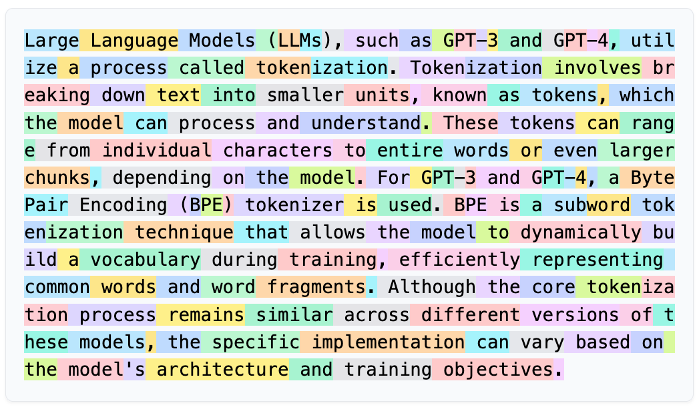

# GPT BPE Tokenizer

## Abstract :

Re-implementation of the byte-pair-encoding algorithm on a toy text from an article to mint 102 tokens I have built this summer (2026).

We added 102 tokens to the 256 initial ASCII tokens + 3 special tokens (`<unk>`,` <s>`, `</s>`) + 39 single character tokens to built up a 400 long vocabulary in the goal of pre-training (no post-training specific tokens were implemented here for stuff like tool-calling, actions, ect..) 

The notebook also includes some discussion on the pros and cons that can arise from tokenization and the dataset selection specific to tokenization, discussing classical tokenization incidents such as the reason why early GPTs were bad with python (bad tokenization of tabs), the reason why they were bad with non-english natural language, or nonsensical tokens as the famous SolidGoldMagikarp token causing random semantics to be assign to a token that appears a lot in the tokenizer dataset but rarely in the actual training set of the GPT.

## Sources :

BPE paper : https://arxiv.org/pdf/2411.08671

Andrej Karpathy's tutorial on this build : https://www.youtube.com/watch?v=zduSFxRajkE

Tiktoken website to compare tokenizers : https://tiktokenizer.vercel.app/

Tiktoken library : https://github.com/openai/tiktoken
